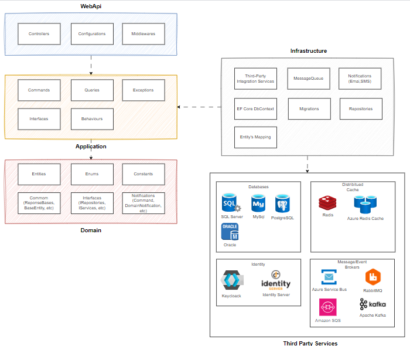

# Guia de Desenvolvimento

O objetivo deste guia, é direcionar o desenvolvimento utilizando os padrões arquiteturais da empresa. Afim de manter a padronização entre os projetos e facilitar as tomadas de decisões durante do desenvolvimento.

## Padrão Arquitetural

Essa API, utiliza o padrão arquitetural chamado Clean Architecture. A principal ideia por trás do Clean Architecture é a separação de responsabilidades, onde a lógica de negócio é separada das preocupações técnicas e dos detalhes de implementação.

## Camadas

### 1. WebApi
**Responsabilidade:** Esta camada é responsável por expor os endpoints da API para os consumidores externos. Atua como a interface entre o sistema e os clientes (navegadores, aplicações móveis, outros serviços).

### 2. Application
**Responsabilidade:** Coordena o fluxo de dados entre a WebApi e a camada de domínio. Contém a lógica de aplicação, incluindo casos de uso específicos que descrevem como a aplicação deve comportar-se.

### 3. Domain
**Responsabilidade:** Contém a lógica de negócio e as regras do domínio. Esta camada é independente de frameworks e bibliotecas externas.

### 4. Infrastructure
**Responsabilidade:** Implementa os detalhes técnicos, como persistência de dados, comunicação com APIs externas e outros serviços de infraestrutura. É a camada mais externa e depende diretamente das tecnologias específicas usadas no sistema.

## Fluxo de Dados entre as Camadas

1. **Requisição:** O cliente faz uma requisição para a **WebApi**.
2. **Validação e Encaminhamento:** A WebApi valida a requisição e encaminha para um caso de uso na **camada de aplicação**.
3. **Lógica de Aplicação:** O caso de uso na camada de aplicação processa a lógica, interagindo com a **camada de domínio** para aplicar regras de negócio e com os **repositórios implementados na camada de infraestrutura** para persistência e comunicação externa.
4. **Resposta:** A camada de aplicação prepara a resposta e a envia de volta para a WebApi, que a retorna para o cliente.