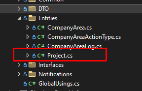
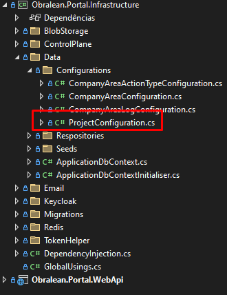
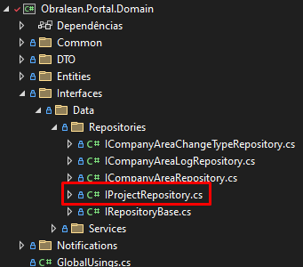
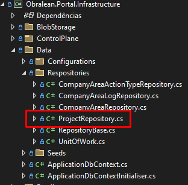
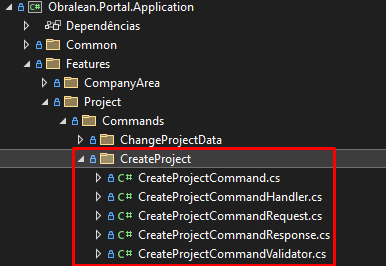
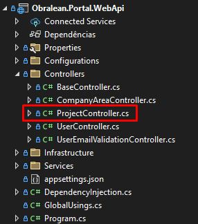

# Exemplo de Desenvolvimento de um Caso de Uso

O objetivo deste guia, é exemplificar o desenvolvimento de uma feature, utilizando todas as camadas da aplicação

Nesse exemplo temos uma entidade chamada Projeto

Para facilitar o desenvolvimento, vamos começar a desenvolver de trás para frente:

1. Vamos primeiro modelar a entidade da qual iremos tratar nessa feature
2. Vamos criar o mapeamento de banco de dados para essa entidade
3. Vamos criar o repositório para persistir os dados na tabela
4. Vamos criar a command que será usada para realizar as validações e acionar o repositório para salvar o Projeto
5. Vamos criar a controller que vai acionar a command a partir de um endpoint

## 1. Modelando a entidade
 - Vamos adicionar o arquivo Project.cs dentro da pasta Entities na camada de Dominio.



 - Dentro da classe vamos colocar o campos que um Project necessita. Nota-se que é uma boa prática os campos de um entidade serem **private set**, uma vez que a própria entidade deve ser capaz de alterar seus dados e realizar possiveis validações. Além disso, toda Entidade deve ser uma **BaseEntity**.
``` csharp
public class Project : BaseEntity
{
    public string Name { get; private set; }
    public string? CEP { get; private set; }
    public string? Address { get; private set; }
    public int? Number { get; private set; }

    public Project()
    {
        NameProject = string.Empty;
    }

    public Project(string name,
                    string cep,
                    string address,
                    int number)
    {
        Name = name;
        Client = cliente;
        CEP = cep;
        Address = address;
    }
}
```
## 2. Mapeando a Entidade em sua representação de Tabela

**obs: uma entidade, não necessariamente é a representação de uma tabela no banco de dados e vice-versa, porém vamos tratar dessa forma para simplificar o desenvolvimento**

 - Vamos primeiro adicionar o classe de Configuration dentro da pasta de Configurations na camada de Infraestrutura
 

 - Dentro dessa classe vamos ter a seguinte estrutura, onde cada propriedade da classe é mapeada para o campo de uma tabela.

``` csharp
public class ProjectConfiguration : IEntityTypeConfiguration<Project>
{
    public void Configure(EntityTypeBuilder<Project> builder)
    {
        builder.ToTable("T_PROJETOS");

        builder.HasKey(ac => ac.Id);

        builder.Property(x => x.Id)
                .HasColumnName("PK_PROJETO")
                .ValueGeneratedOnAdd();

        builder.Property(X => X.Name)
                    .HasColumnName("TX_NOME_PROJETO")
                    .IsRequired();

        builder.Property(x => x.CEP)
                .HasColumnName("TX_CEP_PROJETO");

        builder.Property(x => x.Address)
                .HasColumnName("TX_ENDERECO_PROJETO");

        builder.Property(X => X.Number)
                    .HasColumnName("NR_NUMERO_RESPONSAVEL_PROJETO");
    }
}
```
## 3. Criando a o repositório para persistir os dados no banco

- Primeiro vamos criar a interface do repositório na camada de Dominio.



- Todas as interfaces de Repository devem implementar a interface IRepositoryBase. Dessa forma, podemos utilizar alguns métodos de CRUD básicos presentes na RepositoryBase.

``` csharp
public interface IProjectRepository : IRepositoryBase<Project>
{
}
```
- Com a interface criada, podemos criar a classe de implementação do Repositório dentro da camada de Infraestrutura



- Dentro do implementação do Repositório, devemos herdar os métodos da RepositoryBase
``` csharp
public class ProjectRepository : RepositoryBase<Project>, IProjectRepository
{
    public ProjectRepository(ApplicationDbContext dbContext) : base(dbContext)
    {
    }
}
```
## 4. Criando command
- Vamos começar criando os arquivos necessários para a execução da command



1. **CreateProjectCommandRequest**: Esse é o arquivo de Request, que é o contrato a ser recebido na controller e possui os dados necessarios para processar a command.
``` csharp
public record CreateProjectCommandRequest
{
    public required string Name { get; set; }
    public string? Client {  get; set; }
    public string? CEP { get; set;}
    public string? Address { get; set;}
    public int? Number { get; set;}
}
```
2. **CreateProjectCommandResponse**: Esse é o arquivo de Response que será retornado na execução da command.
``` csharp
public record CreateProjectCommandResponse
{
    public required string Name { get; set; }
    public string? Client {  get; set; }
    public string? CEP { get; set;}
    public string? Address { get; set;}
    public int? Number { get; set;}
}
```

3. **CreateProjectCommandValidator**: Esse é o arquivo de validações da command. Essas validações acontecem de forma automatica e retorna o erro formatado com as mensagem informadas nas regras.
``` csharp
public class CreateProjectCommandValidator : AbstractValidator<CreateProjectCommand>
{
    public CreateProjectCommandValidator()
    {
        RuleFor(x => x.Request.Name)
            .NotNull().NotEmpty()
            .WithMessage("O campo Nome do Projeto é obrigatório.");
    }
}
```

4. **CreateProjectCommand**: Esse é arquivo é command que será executada e vai receber a Request da camada de WebApi.
``` csharp
public class CreateProjectCommand : Command<CreateProjectCommandResponse>
{
    public CreateProjectCommand(CreateProjectCommandRequest request)
    {
        Request = request;
    }

    public CreateProjectCommandRequest Request { get; set; }
}
```

5. **CreateProjectCommandHandler**: É nesse arquivo que tem a lógica a ser aplicada no processamento da command. Onde serão aplicadas as regras de negócios necessárias e persistir os dados no banco através do repositório.

**pontos de atenção:**
 - Como utilizamos o padrão, UnitfOfWork, após todas alterações na base de dados, precimos executar o Commit() para que essas alterações sejam confirmadas na base.
 - Em casso de sucesso na execução da command, lançamos a notification **DomainSuccessNotification**.
 - Em caso de erro na execução da command, lançamos a notification **DomainNotification**. Na camada de WebApi, será indentificada que foi lançada essa notification, e será retornado um BadRequest, com a mensagem presente na notification. **ps: pode ser lançada mais de uma notification na command** 

``` csharp
public class CreateProjectCommandHandler : IRequestHandler<CreateProjectCommand, CreateProjectCommandResponse?>
{
    private readonly IUnitOfWork _unitOfWork;
    private readonly IMediator _mediator;
    private readonly IProjectRepository _projectRepository;

    public CreateProjectCommandHandler(IUnitOfWork unitOfWork, IMediator mediator, IProjectRepository projectRepository)
    {
        _unitOfWork = unitOfWork;
        _mediator = mediator;
        _projectRepository = projectRepository;
    }

    public async Task<CreateProjectCommandResponse?> Handle(CreateProjectCommand request, CancellationToken cancellationToken)
    {
        var newProject = new Project(
            name: request.Request.Name,
            cep: request.Request.CEP,
            address: request.Request.Address,
            number: request.Request.Number);

        var insertedProject = _projectRepository.Add(newProject);

        _unitOfWork.Commit();

        await _mediator.Publish(new DomainSuccesNotification("CreateProject", "Projeto criado com sucesso!"), cancellationToken);

        var response = new CreateProjectCommandResponse
        {
            ProjectId = insertedProject.Id
        };

        return response;
    }
}
```

## 5. Criando controller
- Vamos começar criando o arquivo de controller na camada de WebApi



- Essa controller deve herdar a classe BaseController, e no retorno dos métodos deve ser usado o método Response().

``` csharp
public class ProjectController : BaseController
{
    private readonly IMediator _mediatorHandler;

    public ProjectController(INotificationHandler<DomainNotification> notifications,
                            INotificationHandler<DomainSuccesNotification> succesNotifications,
                            IMediator mediatorHandler) : base(notifications, succesNotifications, mediatorHandler)
    {
        _mediatorHandler = mediatorHandler;
    }

    [HttpPost()]
    public async Task<IActionResult> Cadastro([FromBody] CreateProjectCommandRequest request)
    {
        var command = new CreateProjectCommand(request);
        return Response(await _mediatorHandler.Send(command));
    }
}
```

